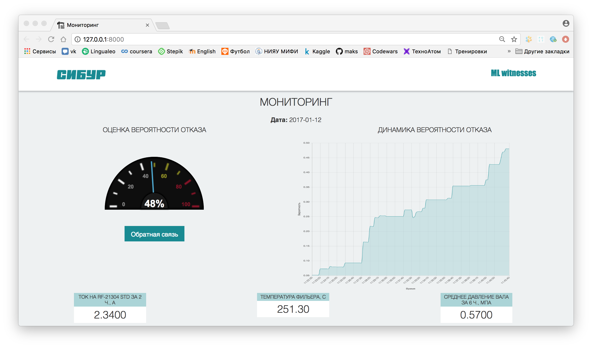
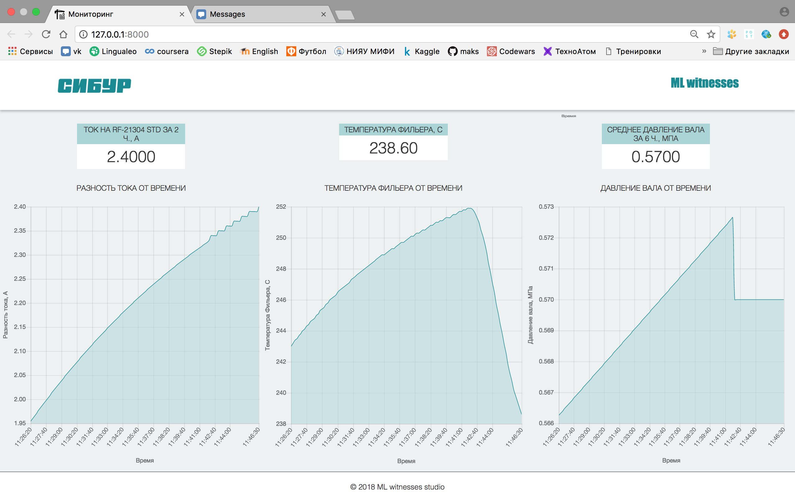

# Хакатон "Цифровой завод" от Сибура

* Организаторы: [Ai community](http://ai-community.com/) & [Сибур](https://www.sibur.ru/)
* Дата: 18-20 мая
* [Задача](./Hackaton_2018_Krot.pdf): Сервис поддержки принятия решений диспетчерской службы

Представляем виртуальный анализатор аномальных состояний процессов производства полипропилена. Основной интерфейс программы представлен на рисунках ниже

    

На интерфейсе представлены графики динамик основных показателей процессов производств, влияющих на целевой параметр грануляции полипропилена - обороты двигателя гранулятора.

    

В случае высокого риска фон приложения принимает соответсвующие цвета:
* вероятность наступления отказа 0.5 - 0.8 - желтый
* вероятность наступления отказа 0.8 - 1 - красный

    

    

## Презентация

Презентацию нашего проекта можно найти <a href="./ml_witnesses.pdf">здесь</a>.

## Команда ML Witnesses

* [Сергей Игнатущенко](https://github.com/alsedi28) - Full-stack developer
* [Максим Шевченко](https://github.com/maks-sh) - Data scientist, UX/UI
* Александр Абрамов - Team-lead Data scientist, Product manager
* Кирилл Иванов - Data science engineer
