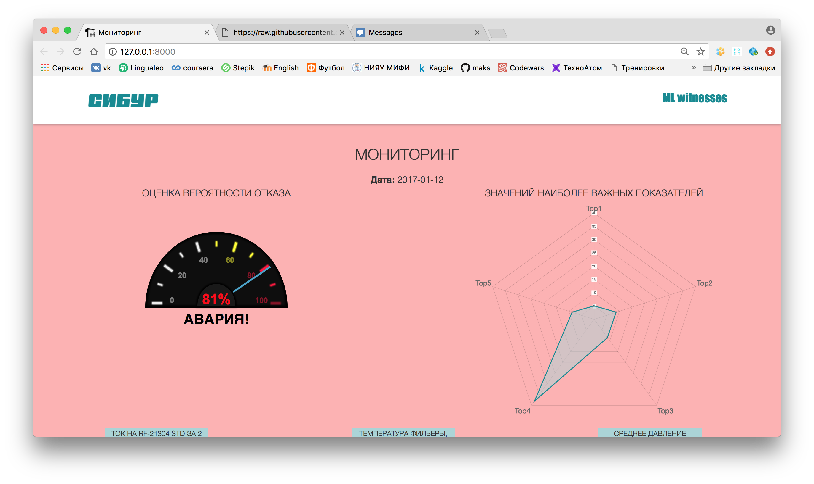

# Хакатон "Цифровой завод" от Сибура

Основной интерфейс программы представлен на рисунках ниже

    

    

В случае высокого риска фон приложения принимает соответсвубщие цвета:
* вероятность наступления отказа 0.5 - 0.8 - желтый
* вероятность наступления отказа 0.8 - 1 - красный

    

    

## Команда ML Witnesses

* Сергей Игнатущенко
* Шевченко Максим
* Абрамов Александр
* Иванов Кирилл